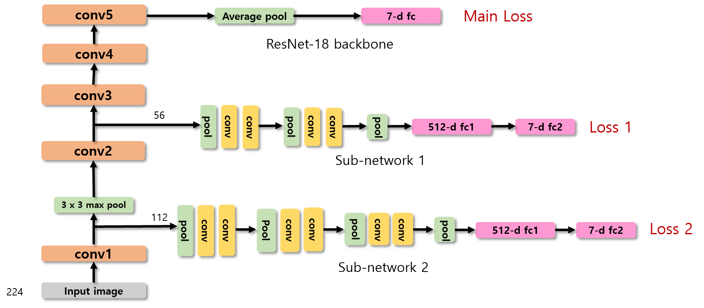

# CombNet: Diagnosis of Skin Diseases using Multi-Scale Features

  
  
This is a Pytorch implementation of CombNet. [(paper here)](https://www.dbpia.co.kr/pdf/pdfView.do?nodeId=NODE09410354&mark=0&useDate=&bookmarkCnt=0&ipRange=N&accessgl=Y&language=ko_KR)  
**CombNet** is a neural network created for image classification: conceived in the feature pyramid structure.
Uploaded codes are written in **pytorch** and are intended to classify skin diseases.
I used datasets from [kaggle - Skin Cancer MNIST: HAM10000](https://www.kaggle.com/kmader/skin-cancer-mnist-ham10000)  
  
***********************************

### Architecture
  

  
Backbone of CombNet is made up of ResNet-18, supported by two types of sub-network from different scale feature maps.  
The following formula is used to calculate the total loss from the three losses:  
  
  
  
In this experiment, the best result was when alpha = 0.5, betha = 0.7  
From this model, you can get around 5% higher accuracy than the plain ResNet accuracy!  
  

### Environment
The model is trained using following hardware:
* GTX TITAN X (Pascal) - 12GB VRAM
* Intel(R) Core(TM) i7-5930K CPU @ 3.50GHz
* 64GB RAM  

The code is developed under the following software:
* Ubuntu 16.04.6 LTS
* CUDA V10.1.243
* Python 3.6.10
* PyTorch 1.5.0
